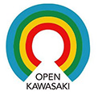
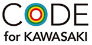

オープン川崎/Code for Kawasaki
----------------

 　　

### オープン川崎とは

川崎市を活性化することを目的とした市民参加型のコミュニティです

* 川崎ならではのコミュニティつくり
* 次世代の人材育成
* 地域を面白くする
* 地域課題解決と新たな事業創造を行う

### Code for Kawasakiとは

Code for Kawasakiは「オープン川崎」が運営母体の分科会で、
Code for Japanのコンセプトに賛同し川崎市の地域社会の向上をITやテクノロジーを利用して行うことを目指して活動をしています

## オープン川崎の考え方

* 川崎はモノづくりにおいては人材の宝庫
* 大人の遊び場の秘密基地を作りたい
* 専門的な活動をするのが分科会
* どこに対しても中立であるべき（中道）
* ジャンルにとらわれずに面白いことをする
* 大人や子供が熱中するようなことをする
* まじめにふざける
* 民主的なコミュニティ

情報共有
----------------
* [Webサイト](http://openkawasaki.org)
* [連絡先メール (info@openkawasaki.org)](info@openkawasaki.org)
* [Twitter (@openkawasaki)](https://twitter.com/openkawasaki)
* [Facebookページ](https://www.facebook.com/openkawasaki/)
* [ブログ(Medium)](https://medium.com/openkawasaki)

メンバー向け
----------
* Discord
    - [招待のリンク](https://discord.gg/zEsYCZ6)
* [GitHub](https://github.com/openkawasaki/)
* [イベントサイト(connpass)](https://openkawasaki.connpass.com/)

関連サイト
----------------
* [LinkData.org](http://linkdata.org/)
  - [オープン川崎](http://idea.linkdata.org/idea/idea1s332i)
  - [Code for Kawasaki](http://idea.linkdata.org/idea/idea1s198i)
* [Localwiki - 川崎市](https://ja.localwiki.org/kawasaki/)

### 旧情報 (現在は稼働してません)
* [Facebookグループ](https://www.facebook.com/groups/opendata.kawasaki/)
* [Facebookページ](https://www.facebook.com/codeforkawasaki)
* [Slack](https://openkawasaki.slack.com)
    - [Slackに参加する](https://join.slack.com/t/openkawasaki/shared_invite/zt-4hbuav6c-Ttza18ObLreA6JZ6mvcyIw)
